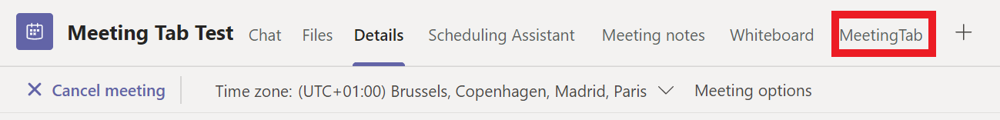
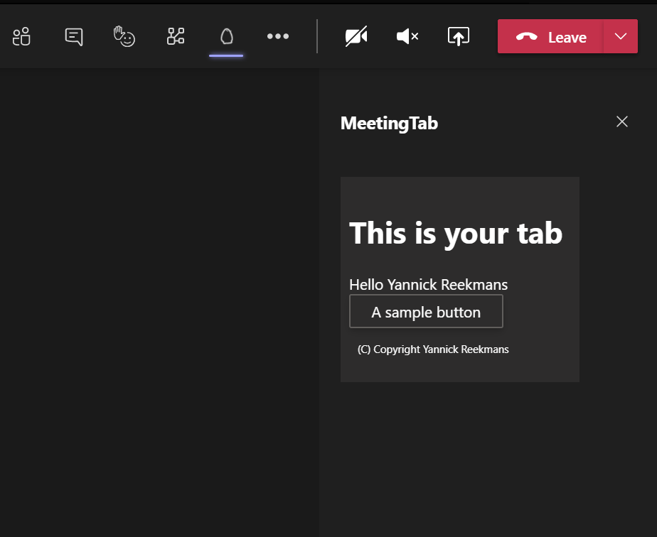

# Teams Development Challenge: Add a tab to a Teams meeting
Adding custom apps to meetings in Microsoft Teams is a very recently announced possibility. The documentation is limited and the community information around this is nearly non-existent. It's a good challenge for those experienced Microsoft Teams developers to take a custom Teams tab and make it available in the different meeting experiences.

## Get ready
- [Make sure you have an Office 365 Developer Tenant](https://developer.microsoft.com/en-us/microsoft-365/dev-program)  
- [Make sure you have your Teams client in Developer preview](https://docs.microsoft.com/en-us/microsoftteams/platform/resources/dev-preview/developer-preview-intro)  
- [Read the available documentation](https://docs.microsoft.com/en-us/microsoftteams/platform/apps-in-teams-meetings/teams-apps-in-meetings)
- [Install Yeoman Generator for Microsoft Teams](https://github.com/pnp/generator-teams) and the extra dependencies for Teams development  
- Create an App Service in Azure (Runtime stack Node 12 LTS) for hosting your tab  
- Create an Azure Front Door to put in front of your App Service, and keep the URL handy  
- [Create an Azure AD application for SSO](https://docs.microsoft.com/en-us/microsoftteams/platform/tabs/how-to/authentication/auth-aad-sso#1-create-your-azure-active-directory-azure-ad-application)  

## Create a Teams Tab
### Run Yo Teams
Open a command prompt, navigate to the directory where your project should be created and execute.  
```
yo teams
```
Run through the configuration questions, and make sure you select `Tab` as a feature to add to your project.  
Other features can be added but are not necessary.
Running through the additional questions:  
- when asked for a URL, enter the Azure Front Door url you created  
- make sure you select your Tab to be of the `Configurable` kind
- make sure you select both `In a Team` and `In a group chat` scope  
- make sure you enable SSO support  

## Challenge 1: Show Teams tab in the pre/post/during-meeting experience  
Make your new custom Teams tab show up in the header of the meeting details view of the calendar and an in-meeting panel opened via the unified bar (u-bar).
  
  

## Challenge 2: Show different information in the pre-meeting vs. during meeting vs. post-meeting experience
Make your custom tab show different information before a meeting vs after a meeting, and also different content during the meeting.  

## Challenge 3: Show different information for attendees vs. presenters  
Make your custom tab show different information depending on the role of the user during the meeting.  